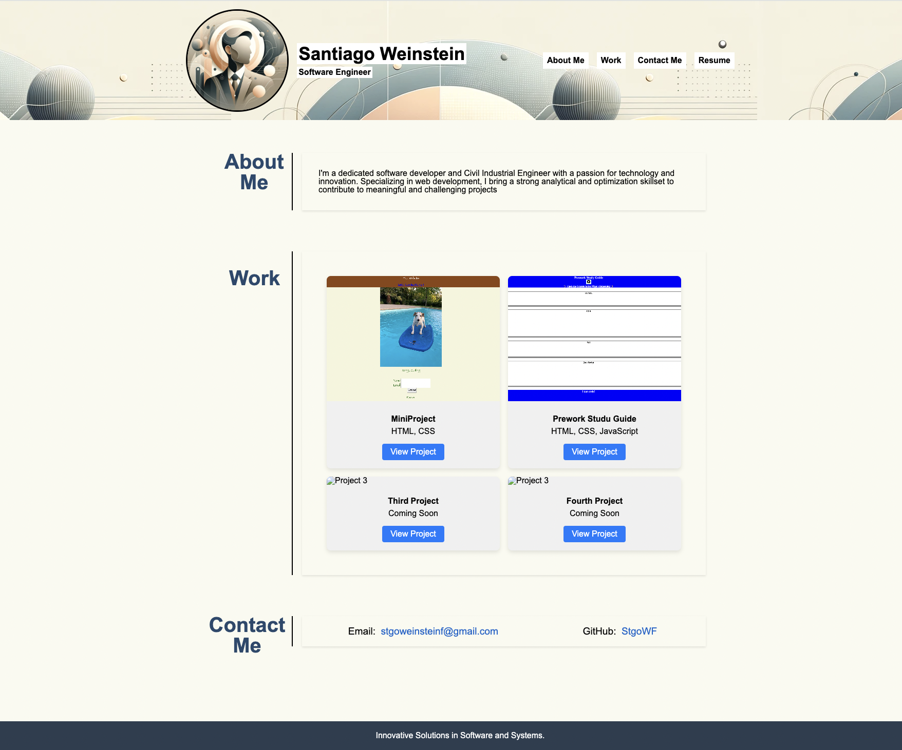

# Professional Portfolio

## Overview

This portfolio showcases my web development projects and skills, emphasizing advanced CSS techniques like flexbox, media queries, and CSS variables. It's designed to be responsive, ensuring a great experience on all devices.

## Features

- **About Me**: Introduction and a brief overview of my professional background.
- **Projects**: Highlighted work samples demonstrating my capabilities.
- **Contact**: How to get in touch with me.

## Screenshot

## Live Demo

Check out the live portfolio [here](https://stgowf.github.io/Proyect-2/).

## Usage

- Navigate through the portfolio using the top menu.
- Click on project images to see the live applications.
- Visit the contact section for my contact details.

## Getting Started

To view the website locally, clone this repository and open `index.html` in your web browser.

## Contributing

Contributions are welcome! Please fork the repository and open a pull request with your proposed changes.

Thank you for visiting my project!
